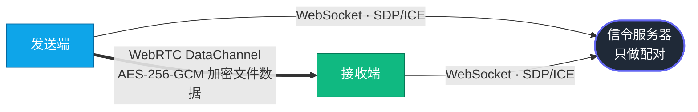

<div align="center">

# NexusP2P

**点对点大文件极速传输平台 —— 数据只走你和对方之间，服务器看不到一个字节。**

基于 WebRTC DataChannel 的端到端加密传输：拖进去、拿到九位文件码、对方开始下载。
没有云端中转，没有文件大小限制，没有上传等待。

[](https://github.com/wenluwindy/NexusP2P/releases/latest)
[](https://github.com/wenluwindy/NexusP2P/releases)
[](https://dotnet.microsoft.com/)
[](#下载)

**当前版本 v2.2.0** —— 网页端流式另存、多文件一键 ZIP、可选访问密码。[查看更新内容 →](#版本历史)

[下载](#下载) · [快速开始](#快速开始) · [工作原理](#工作原理) · [自部署](#部署信令服务器) · [文档](#文档)

</div>

---

## 为什么是 NexusP2P

传统网盘的流程是「上传到别人的服务器 → 等待 → 对方下载」。你付出两倍的时间，还要相信对方保管好你的文件。

NexusP2P 把这一步删掉了。

| | 传统网盘 / IM 传文件 | NexusP2P |
| :-- | :-- | :-- |
| 传输路径 | 你 → 云服务器 → 对方 | 你 ⟷ 对方（直连） |
| 等待时间 | 上传完才能下载 | 对方接入即开始流动 |
| 文件大小 | 受套餐限制 | 只受磁盘限制 |
| 服务器可见性 | 明文存储、可扫描 | 只转发 SDP/ICE，看不到内容 |
| 局域网速度 | 走公网绕一圈 | 直接跑满内网带宽 |
| 断网之后 | 通常重传 | `.part` 续传，接着上次继续 |

> 回环基准测试：**75.8 MiB/s（0.59 Gbit/s）**，传输 1 GiB 耗时 13.5 秒，进程工作集稳定在 ~70 MiB。
> 详见 [`spike/LibDataChannelThroughput`](spike/LibDataChannelThroughput)。

---

## 核心能力

<table>
<tr>
<td width="50%" valign="top">

### 传输
- **P2P 直连**：局域网直连 / 公网 NAT 打洞 / TURN 中继三级回退
- **文件与文件夹**：整目录树打包传输，保留结构
- **断点续传**：基于本地 `.part` / `.meta` 状态，重启进程也能接着传
- **自动重连**：网络抖动、切换 Wi-Fi 后自动恢复会话
- **背压控制**：内存占用恒定，20 GiB 文件不会撑爆进程

</td>
<td width="50%" valign="top">

### 安全
- **AES-256-GCM** 内容加密，分片位置参与 nonce 派生
- **SHA-256 Merkle 树**，分片级完整性校验
- **密钥由发送方在加密通道内推送**，接收方只需九位文件码
- **可选访问密码**（网页端）：在文件码之外加一道进房门槛，密码错误与码无效同样不可区分
- **路径穿越防护**，接收端强制校验清单路径
- **零信任中继**：即使走 TURN，中继方也只看到密文

</td>
</tr>
<tr>
<td width="50%" valign="top">

### 客户端
- **Windows 桌面端**（WPF）：拖放、托盘常驻、实时进度
- **CLI**：适合服务器、脚本、自动化流水线
- **网页端**：原生 ES Module，零构建步骤，打开即用
- **流式另存 / 一键 ZIP**（网页端）：Service Worker 把收完的内容直落下载文件夹，多文件自动打包成单个 ZIP —— 没有 File System Access API 的浏览器也能流式保存，内存占用恒定

</td>
<td width="50%" valign="top">

### 自部署
- **Docker / Docker Compose** 开箱即用
- **systemd** 服务单元 + **Nginx** 反代示例
- **1Panel** 面板部署指引
- 信令服务无状态、单文件自包含发布

</td>
</tr>
</table>

---

## 下载

[前往 Releases 下载 v2.2.0 →](https://github.com/wenluwindy/NexusP2P/releases/latest)

**Windows 客户端**

| 文件 | 说明 |
| :-- | :-- |
| `NexusP2P-Setup-2.2.0-win-x64.exe` | 安装包，自包含运行时，**无需另装 .NET** |
| `nexusp2p-win-x64.zip` | 免安装绿色包，含桌面端 + CLI + 信令服务器 |

**Linux 信令服务器**（自部署用，自包含单文件，目标机无需装 .NET 运行时）

| 文件 | 说明 |
| :-- | :-- |
| `nexusp2p-signaling-linux-x64.tar.gz` | 常规 x86_64 服务器 / 云主机 |
| `nexusp2p-signaling-linux-arm64.tar.gz` | ARM 服务器、树莓派、部分云主机 |

包内含 systemd 服务单元、Nginx 反代示例与部署说明，解压后按 [`packaging/LINUX.md`](packaging/LINUX.md) 部署即可。

> 不想装任何东西？打开网页端直接用 —— 网页端「设置」页同样提供下载入口。
> 网页端由信令服务器一并托管，部署好服务器就有了网页端，没有额外的构建步骤。

---

## 快速开始

### 三步传一个文件

```
1. 发送方   拖入文件  ──►  拿到九位文件码
2. 传给对方  把码念给对方（或发分享链接）
3. 接收方   输入码，选目录  ──►  开始直连传输
```

> 只需要文件码 —— 没有密钥要转述。密钥在连接建立后由发送方自动送达。

### 环境要求

| 组件 | 要求 |
| :-- | :-- |
| 构建 | .NET SDK 9.0+ |
| 网页端测试 | Node.js 20+ |
| 桌面客户端 | Windows + .NET 9 Desktop Runtime（安装包版本无需） |

### 桌面客户端

```powershell
dotnet run --project src/NexusP2P.Desktop
```

在「设置」中填入信令服务器地址即可开始使用。

### 命令行客户端

<details open>
<summary><b>发送文件或文件夹</b></summary>

```powershell
dotnet run --project src/NexusP2P.Cli -- send .\example.iso `
  --signaling https://p2p.example.com
```

</details>

<details>
<summary><b>接收：使用九位文件码</b></summary>

```powershell
dotnet run --project src/NexusP2P.Cli -- receive 123-456-789 `
  --dest .\downloads `
  --signaling https://p2p.example.com
```

</details>

<details>
<summary><b>接收：使用分享链接</b></summary>

```powershell
dotnet run --project src/NexusP2P.Cli -- receive "https://p2p.example.com/r/123456789" `
  --dest .\downloads `
  --signaling https://p2p.example.com
```

</details>

信令地址解析优先级：`--signaling` 参数 → `NEXUSP2P_SIGNALING` 环境变量 → 可执行文件同目录的 `nexusp2p.json`。
完整用法：`dotnet run --project src/NexusP2P.Cli -- --help`

---

## 工作原理



信令服务器**只**传递建立连接所需的协商信息，不接触任何文件字节。

文件数据在两端之间用 AES-256-GCM 加密，即使连接降级为 TURN 中继，
中继方看到的也只是密文。密钥由发送方在 WebRTC 的加密数据通道内送达接收方 ——
用户因此只需要转述九位文件码。

> **请使用你信任的信令服务器。** 密钥经由该服务器协商的连接传递，
> 一个恶意的信令服务器有能力在协商阶段做中间人。被动记录流量则无法解密。

<details>
<summary><b>连接建立的三级回退</b></summary>

```
① 局域网直连     同一网段，速度上限 = 网卡带宽
② NAT 打洞       STUN 辅助，穿透大部分家用/办公网络
③ TURN 中继      前两者失败时兜底，速度受 TURN 上行带宽限制
```

校园网 AP 隔离等特殊场景的实测记录见 [`docs/spikes/campus-ap-isolation.md`](docs/spikes/campus-ap-isolation.md)。

</details>

---

## 部署信令服务器

### 关键配置

`Signaling:PublicOrigin` 用于生成分享链接，**生产环境必须显式配置**：

```json
{
  "Signaling": {
    "PublicOrigin": "https://p2p.example.com"
  }
}
```

### 开发环境运行

```powershell
dotnet run --project src/NexusP2P.Signaling
```

健康检查：`GET /health`

### 生产部署

| 方式 | 文件 |
| :-- | :-- |
| Docker / Compose | [`packaging/docker/`](packaging/docker/) |
| Linux 通用指引 | [`packaging/LINUX.md`](packaging/LINUX.md) |
| 1Panel 面板 | [`packaging/1PANEL.md`](packaging/1PANEL.md) |
| systemd 服务 | [`packaging/nexusp2p-signaling.service`](packaging/nexusp2p-signaling.service) |
| Nginx 反代 | [`packaging/nginx-nexusp2p.conf`](packaging/nginx-nexusp2p.conf) |
| Windows 启动脚本 | [`packaging/start-signaling.ps1`](packaging/start-signaling.ps1) |

<details>
<summary><b>手动发布单文件自包含服务</b></summary>

```powershell
dotnet publish src/NexusP2P.Signaling/NexusP2P.Signaling.csproj `
  --configuration Release `
  --runtime linux-x64 `
  --self-contained true `
  --output .\artifacts\signaling-linux-x64
```

</details>

> **生产环境检查清单**：启用 HTTPS · 显式配置 `PublicOrigin` · 跨网络场景配好 STUN/TURN · 反代必须支持 WebSocket 升级 · 加上限速与房间数量上限。

---

## 构建与测试

```powershell
dotnet restore NexusP2P.sln
dotnet build   NexusP2P.sln --configuration Release
dotnet test    NexusP2P.sln --configuration Release
```

打包发布：

| 命令 | 产物 |
| :-- | :-- |
| `./packaging/package.sh win` | `dist/nexusp2p-win-x64.zip`（桌面端 + CLI + 信令服务器） |
| `./packaging/package.sh linux` | `dist/nexusp2p-signaling-linux-{x64,arm64}.tar.gz`（自包含信令服务器） |
| `./packaging/package.sh all` | 以上全部 |
| `./packaging/build-installer.ps1 -Version 2.2.0` | `dist/NexusP2P-Setup-2.2.0-win-x64.exe`（需 Inno Setup） |
| `./packaging/package-dll.sh` | framework-dependent 包（目标机已有 .NET 运行时时体积更小） |

版本号来自 `NEXUSP2P_VERSION` 环境变量；正式发布由推送 `v*` 标签触发 GitHub Actions
（[`.github/workflows/release.yml`](.github/workflows/release.yml)）自动构建 Windows 与 Linux 两端产物并发布到 Releases。

网页端测试：

```powershell
cd src/NexusP2P.Web
npm test
```

> 网页端是原生 ES Module，**不需要 Webpack / Vite 或任何打包器**。构建信令项目时会自动把 `src/NexusP2P.Web/wwwroot` 复制到输出目录。
> 仓库启用了 `TreatWarningsAsErrors`，构建必须零警告。

---

## 项目结构

```
NexusP2P/
├── src/
│   ├── NexusP2P.Core          清单 · 路径 · 哈希 · Merkle · 加密 · 文件码
│   ├── NexusP2P.Transport.*   数据通道抽象与 WebRTC 实现
│   ├── NexusP2P.Transfer      帧协议 · 分片存储 · 收发会话 · 重连
│   ├── NexusP2P.Agent         传输编排 · 配置 · 设置
│   ├── NexusP2P.Signaling     ASP.NET Core 信令服务器 + 网页托管
│   ├── NexusP2P.Web           原生 ES Module 网页端
│   ├── NexusP2P.Cli           命令行客户端
│   └── NexusP2P.Desktop       Windows WPF 桌面客户端
├── tests/                     核心 · 传输 · Agent · 集成 · 跨进程测试
├── docs/                      协议规范 · 架构决策 · 验证记录
├── packaging/ · deploy/       发布与部署文件
└── spike/                     WebRTC 选型与吞吐量验证实验
```

---

## 文档

| 主题 | 文档 |
| :-- | :-- |
| 传输协议 | [`docs/formats/protocol.md`](docs/formats/protocol.md) |
| 信令协议 | [`docs/formats/signaling.md`](docs/formats/signaling.md) |
| Wire 格式 · 文件码 · 分享链接 | [`docs/formats/wire.md`](docs/formats/wire.md) |
| 哈希与 Merkle 校验 | [`docs/formats/hashing.md`](docs/formats/hashing.md) |
| WebRTC 实现选型（ADR） | [`docs/adr/001-webrtc-implementation.md`](docs/adr/001-webrtc-implementation.md) |
| 网络约束实测 | [`docs/spikes/network-constraints.md`](docs/spikes/network-constraints.md) |
| 校园网 AP 隔离验证 | [`docs/spikes/campus-ap-isolation.md`](docs/spikes/campus-ap-isolation.md) |
| 浏览器存储能力验证 | [`docs/spikes/browser-storage.md`](docs/spikes/browser-storage.md) |
| v2.2.0 变更记录 | [`docs/报告/CHANGELOG_V2.2.0.md`](docs/报告/CHANGELOG_V2.2.0.md) |

---

## 安全边界

我们更愿意把话说清楚，而不是含糊地写「军工级加密」：

- ✔ 服务端不保存文件字节
- ✔ 文件内容使用 AES-256-GCM，分片位置参与 nonce 派生，收到的数据还要过 Merkle 校验
- ✔ 接收端校验清单中的每一条路径，防止写出目标目录
- ✔ TURN 中继只能看到流量元数据与密文，被动记录流量无法还原内容
- ⚠ **文件码就是接收这次传输的唯一凭证** —— 念给谁，谁就能收，请像口令一样对待
- ⚠ **请使用你信任的信令服务器**：密钥经由它协商的连接传递，恶意的信令服务器
  有能力在协商阶段做中间人。这是「只念一串数字就能收」的代价 ——
  在此之前密钥藏在 URL fragment 里，服务器在密码学上无法解密，但用户得转述
  43 个字符的密钥，实际上没人做得到
- ⚠ 信令房间与文件码**不是身份认证机制**，生产环境务必配合 HTTPS、限速与房间上限
- ⚠ **访问密码（v2.2.0，可选）**只是文件码之外的第二道进房门槛：服务器只存 PBKDF2-SHA256
  校验值而不存明文，但它经由信令服务器校验，服务器看得到它。密码错误与文件码无效返回同一句
  「房间不可用」，不引入新的枚举通道。请与文件码**分开渠道**传递

---

## 已知限制

- 桌面 GUI 目前仅面向 Windows；跨平台能力主要由 CLI 与信令服务承载
- 能否 P2P 直连取决于双方网络环境，直连失败时需要可用的 TURN 服务兜底
- 信令房间保存在内存中，服务重启会清空；但已落盘的分片进度不依赖房间，重新发起即可续传
- 中继模式的实际速度受 TURN 服务器上行带宽限制
- 网页端的流式另存与一键 ZIP 依赖 Service Worker，因此只在 HTTPS（或 localhost）下可用；
  被浏览器拦截或归档超过 4 GiB（zip64 之外）时自动回退到逐文件下载链接，数据不会丢
- 访问密码由信令服务器校验，服务器看得到它 —— 它挡的是「拿到文件码但没拿到密码」的人，
  内容机密性依赖 AES-256-GCM 而不是这道密码
- [`dist/`](dist/) 中的预构建产物未必对应最新源码，**以源码构建为准**

---

## 版本历史

| 版本 | 主要变化 |
| :-- | :-- |
| **v2.2.0**（当前） | 网页端 Service Worker 流式另存、多文件一键 ZIP 打包、可选访问密码；wire 与 v2.1.0 逐字节一致，无需迁移 |
| v2.1.0 | 接收端只需九位文件码，密钥改由发送方在加密通道内推送 |
| v2.0.1 | 修复网页端看不到分享链接 |
| v2.0.0 | 一对多分发（一次发送、多人接收）、网页端界面重做 |
| v1.0.1 | 桌面端自动更新、安装器本地化修复 |
| v1.0.0 | 首个正式版本：P2P 直连、断点续传、桌面端 / CLI / 网页端 |

完整的 v2.2.0 变更记录见 [`docs/报告/CHANGELOG_V2.2.0.md`](docs/报告/CHANGELOG_V2.2.0.md)，
历次发布产物见 [Releases](https://github.com/wenluwindy/NexusP2P/releases)。

---

## 贡献

欢迎提交 Issue 与 Pull Request。

涉及 **协议 / 加密 / 断点续传 / 路径处理 / 信令安全** 的修改，请同时：

1. 补充对应的测试用例
2. 更新 `docs/` 下相关的协议或架构文档
3. 确保 `dotnet build --configuration Release` 零警告通过

---

## 许可证

[MIT License](LICENSE)

<div align="center">

---

如果这个项目帮你省下了等待上传进度条的时间，欢迎点一个 Star

[](https://github.com/wenluwindy/NexusP2P/stargazers)

</div>
